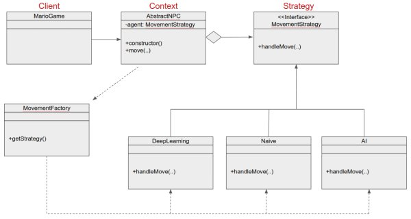

# Software Engineering
The process of **analyzing user needs** and designing, constructing, and testing end user applications that will satisfy these needs.

## Processes
Dividing software development work into distinct phases to **improve design, product management and project management**  

* Types of Processes:
* * Traditional
* * * Waterfall - Linear Sequential Design approach.
* * * Spiral - Combination of Waterfall and Iterative.
* * Agile - Req and Solutions evolve through collab effort of developers, managers and clients.
* * * XP - Communication, Simplicity, Feedback, Courage, Respec
* * * TDD - Building with heavy emphasis on automated unit testing (write tests before developing)
* * * Scrum - Product backlog (all issues assigned to dev team) -> Planning to address subset of backlog for individual sprints -> Work on indv sprints tgt with stakeholders.
## Specifications
Description of a software system to be developed. Lays out both **functional and non-functional requirements** and may include a set of use cases that describe user interactions that software must provide.  

* Requirements process - Identify the functional (what the program should do) and non-functional (properties the system should have) requirements.
* * Should be **Complete, Consistent, Precise and Concise**
* * Elicitation - Requirements are gathered and looked at between customer and dev team.  

* Validating Requirements - Breakdown objectives to be measurable so they can be evaluated easily (Eg. The system needs to be fast -> the system must load within 1s)

* User stories - Short concrete documents that capture who a feature is for, what its value is, whats involved in creating that feature, what its costs are and how long to build it. **Increases cohesion** between customers and dev team. Done in 5 parts.
* * Role-Goal Benefit - Is the feature worthwhile and adds value?
* * Limitations - Scope down to apply only on a subset of situations that matter for this feature
* * Definition of Done - How to validate the feature is complete
* * Engineering Tasks - How the feature will interact with other features
* * Effort Estimate - Value of the feature compared to the cost of building it

* INVEST - Guideline to write effective user stories
* * Independence, Negotiable, Value, Estimable, Small, Testable

* Decomposing User stories - Turning User stories into code
* * Find Entities, Link Entities, Bind Actions, Prototype, Formalize, Implement  

## Testing
Evaluation of the software against requirements gathered from users and system specifications. Tests should be **fast, reliable, isolate failures and be able to simulate users.**  

* Kinds of tests
* * Unit - How correct a single small contained method is
* * Integration - Indv software modules are combined and tested as a group
* * Systems - Conducted on a complete integrated system to evaluate compliance with specified requirements.
* * Acceptance - Test conducted to determine if the requirements of a specification or contract are met.

* Red Green refactor - Red - Create a test and make it fail. Green - Make the test pass by any means. Refactor - Change the code to remove duplication in the project and improve the design while ensuring all the tests pass.

* White box testing - Testing the internal workings of a software (at the source code level)
* * Line and statement coverage - If we have a function, we need to write various tests that ensure that all possible lines of code within the function are executed.
* * Branch and Path coverage - If we have a function, we need to write tests to ensure that every possible branch from each decision point is executed at least once.

* Black box testing: Equivalence Class partitioning (When we don't have access to the source code. As an API user, come up with tests by focussing on the I/O that the system produces.
* * Equivalence Class partitioning - Partition the input data into different partitions from which test cases can be derived from.
* * Input Partitioning - Eg. From all sounds, we have MP3 and OGG sounds. Just test 1 from each subclass to make sure they both work
* * Output Partitioning - Where we care more about the outputs. Instead of testing all range of values, just take 1 and -1 to make sure they work
* * Boundary Value Analysis - Testing edge cases/ extreme ends.  

* Assertions - Assertions are to test behavior of the individual methods while black/white box testing are to test various interactions among all the methods.  

* Testability - **Reach** (ability to reach the code to test), **Trigger** (Ability to trigger the defects), **Propagate** (Propagate the result to somewhere we can observe it), **Observe** the fault, **Interpret** the faults.  

* Controllability - Refactoring our code to make test cases easier to write. More succinct and easier to understand. (Example, instead of passing in a DOM object, we can pass in a jQuery Object. This way, we do not need to load the DOM whenever we want to test the code.)  

* Observability - Writing code in a way that can differentiate between correct and incorrect behavior. (Example, if our code does not return anything, we can modify it to return a value that can allow us to test if the internals are working as intended.)  

* Isolateability - Refactor our code to ensure that each function does only one thing. Easier to test different modules separately and identify break points  

* Automatability - Instead of manually testing our code, spend the time to write automated tests. Can save a lot of time and identify faults much quicker  

## High Level Design
High level design guidance with the goal of improving the **evolvability and maintainability** of software systems over time.

* Abstraction - Used to manage complexity of our apps. Allows us to focus on the key aspects of information that are required for a given task and stakeholder.
* * Structured Programming - Promises, allow sequences of asynchronous operations without needing nested callbacks.
* * Decomposition - Process of breaking down a high level complex description of a system into more manageable pieces. Eg: Game -> Level, Figures -> (For level) Items and sounds, (For figures) Mario, enemies.
* * Encapsulation - Done through interfaces. Allows us to separate data and behavior of a class from its implementation. Eg: Encapsulate gravity for Mario.
* * * Interface Gravity{ public setGravity(gravConstant) public calcDisplacement(currentRate)}
* * * The gravity of the level is set by setGravity and Mario calls the calcDisplacement method.
* * Information Hiding - Hide specific details about implementation away from the high level interfaces of what's being provided by the code. All the developer needs to know is that he calls the method and gets a displacement, without needing to know about the implementation.  

* Technical Representation - Idea -> Specification -> Design -> Code. Making things more concrete as we go down the levels.
* * Use of diagrams. Diagrams have to be accurate, precise and concrete.
* * Views - Enable different stakeholders to get different views. One common way is through UML diagrams. There are Structual Diagrams (Under which there are class and deployment diagrams) and Behavioural diagrams (Sequence and State Machine diagrams) which are important for different stakeholders.
* * * Deployment Diagrams are used to concretely talk about execution environment.
* * * State Machine Diagrams are used to reason about the core states a system will be in and how we transition from one state to the next.
* * * Sequence Diagrams shows object interactions arranged in time sequence. It depicts objects and classes involved and the messages exchanged to carry out functionality of the scenario
* * * Class diagrams clearly map out the structure of a particular system by modelings its classes, attributes, operations and relationships between objects.  

* APIs - Application Programming Interfaces are programmatic interfaces for source code elements.
* * High level API design - Follow these 4 principles. 1. Do one thing 2. Never Expose Internals 3. Small as possible 4. Usability
* * Low level API design - Instead of taking in First Name, Last Name, Email, User Name -> Transform this into a User object instead. Return Descriptive objects instead of primitive types. Handle exceptional cases > Don't return null, return an empty list or throw an exception.
* * API Design Process - 1. Start with Short Spec 2. Solicit Feedback 3. Prototype 4. Think from customer's perspective and use cases.
* * API Usability
* * * Visibility - Make it easy to look at the API and understand what it does. Make it hard to misuse the API
* * * Model - Provide them with the abstractions that make it easy to accomplish their tasks. Having names that map to the tasks that the developer is trying to accomplish. Eg: Abstract away things like department and shelf and just return a product, if they only care about getting product details.
* * * Mapping - Provide an effective mapping between the ideas that a developer has in mind and the affordances provided by our API. Eg: Provide details and information of return types.
* * * Feedback - Let the user know when they've used an API incorrectly. Eg: Validate parameter types.  

* REST Development - Representational State Transfer.  
You give your web browser a URL and that makes a request to a remote server. The server will generate the content that you asked for and send it back to you in the form of HTML that will be rendered by the browser. Get, Put, Post and Delete as access methods. REST services communicate using intermediate representations. When a REST service wants to return a response, it will generate a representation of its internal data that's amenable for client use (maybe in XML, HTML or JSON). The REST service enforces information hiding as the client does not see the back end representation, only the format sent back as the intermediate representation. Lastly, REST services sends self-descriptive hypermedia documents i.e. it sends forwarding links to help you understand other actions you can do with the response data. This enables them to be stateless and increases scalability.
* * A client sends a **request** to a server. The 4 common request types are: GET - Find, POST - Create, PUT - Update, DELETE - Delete. You can also include additional metadata in the request headers. The requests should be idempotent (except POST), which means the same request should give the same result every time.
* * After receiving a request, the server sends a **response** back to the client. The response contains 2 components, the header and body. The header contains metadata including the status code, such as 200, 404 etc. The body can be returned in many formats, (XML, JSON, HTML) but not plain text, since it is not descriptive.
* * Statelessness is a core architectural constraint for all REST systems. This means that REST clients are responsible for maintaining all of their own state as they proceed through their transaction. This makes REST servers easier to scale and enables caching and server switching.
* * * There are 2 types of states, reverse and application. REST clients need to maintain application state themselves. The main way statelessness is enabled is through connectedness which leverages the self descriptive nature of REST representations. Eg: When using Github REST API to create a new project, instead of sending 200 and an empty body, we can instead return a body with details about what to do now that the repo is created (links to issues, stars for repo etc). At the same time, the representation would still hide other implementation details.
* * * To evolve our APIs over time, we can include versioning within the REST requests. Eg: GET /v2/users or GET /users/?v=2. We can also include metadata in the headers with the version.
* * * Another common task for REST is authentication. This can be done through HTTP basic authentication through HTTPS or using cookies to track authenticated users. Finally, we can use a token based approach such as OAuth.  

* Coupling - How strongly connected different program classes are to one another.
* * We should aim to minimize the interfaces that exist between different program elements. We should also minimize the complexity of those interfaces so they only reveal the minial surface required to provide the functionality thats needed. Lastly, we need to minimize the control flow constraints that exist between modules.  

* Cohesion - How well-focused are the methods and fields within a class, how well the elements within a class belong together. We should aim to have a larger number of smaller classes, so that we can isolate changes and makes maintenance and evolution easier.  

* Design Principles - The flexibility of software systems means they can be designed in various ways. We want our systems to be easy to understand, quick to diagnose and fix, and amenable to future changes.
* * Design symptoms, which we use to evaluate different system designs.
* * * Rigidity - Design that is resistant to change. A small change propagates through entire system
* * * Fragility - Design thatis easy to break. Lax in pre and post condition checking
* * * Immobility - Most lines of code are not truly unique.
* * * Viscosity - If the system is slow, devs will batch their changes together and submit them.
* * * Needless Complexity -  Overbuilt abstractions result in cognitive overhead
* * * Repetition - Copying code introduces clones that must be updated consistently
* * * Opcaity - Glom functionality instead of introducing new classes.
* * Single Responsibility - A software module should do only one thing and do it good.
* * Open/Closed Principle - Systems should be open to extension but closed to modification. We should extend the functionality of a base class (dont modify the base class).
* * Liskov Substitution - Any object in a program should be interchangeable with any other object that has the same parent type.
* * Interface Segregation Principle - Clients should not be forced to depend on interfaces that they do not use. Interfaces should be focused on a tight specific set of functionality. Eg: Split the Figure interface into a Player Interface and AI interface.
* * Dependency Inversion Principle - Classes should depend on abstractions not on implementations. This decouples implementations from one another by introducing abstractions, usually in the form of interfaces between them.

## Low Level Design  
How our high level design will be implemented by developers once they start coding. There are 3 guidelines. 1. Encapsulate what varies (Easily extended and easy to solve bugs) 2. Ensure we are programming to interfaces (Decouples our implementation from our design) 3. Favour composition over inheritance (make our code more dynamic and there is less coupling)  

* Design Patterns Overview - Each design pattern has a name, a problem they are trying to solve and a solution. We need to evaluate the pros and cons of each design pattern and choose one. There are 3 high-level categories of design patterns.
* * Creational - Help us build objects in an extensible way
* * Structural - Help us structure our systems in ways that help us avoid future evolutionary problems
* * Behavioural - Make it so we can easily add new behaviours to our systems at runtime.  

* Singleton (Creational) - Simplest Design Pattern. It solves cases where we have an object we want to use widely
throughout our system but we don't want to have to pass an instance of that object to each place we want to use it. It is often the case that we only want to have a single instance of an object.
* * Each singleton is essentially a global variable (Be cautious about when to use it)
* * Example: For mario game, a sound manager instance which is passed to all the different types within the game that want the ability to play a sound. The sound manager will also handle when 2 sounds come in at the same time.  

* Strategy (Structural) - Solves cases where we don't know all possible variations in advance, hence we want to provide a mechanism for encapsulating algorithms to allow future extension. We do so by having explicit interfaces that we can plug in new algorithms as we add new requirements.
* * Strategy is a classic example of using polymorphism to hide concrete types behind more abstract interfaces
* * Example: For Mario, we can have an NPC class which calls on a MovementStrategy interface. The interface has a handleMove() method. We then have 3 different classes to implement this interface, the DeepLearning, Naive and AI class. This allows extensibility by just adding a new class to the interface when required. The different strategies can also be called depending on the difficulty of the level.  

* State (Behavioural) - Gives us a way to vary the behavior of programs in an incredibly dynamic way. It does so by encapsulating the states explicitly within state objects and allow those objects to manage the transitions between different states. This removes the responsibility from the client objects and makes it easier for us to add new states to our system without modifying all of the different clients that already depend on the states which existed before.
* * Similar to the Strategy Pattern except there is a reference to the context object within the state.
* * Example: For Mario, we have a MarioState interface. This has a hit() and trigger() method. We then have a Small State, Large State and Invincible State, and Mario can transition between each state by eating a mushroom, getting hit or eating a star. The level class calls setState() whenever a change of state is required.  

* State and Strategy - Although they are similar in implementation, State and Strategy patterns are used for different purposes. The State is meant to change dynamically during runtime while the strategy pattern is set at the beginning and used throughout the system.
* Facade (Structural) - Reduces the apparent complexity of a subsystem by really thinking about what the high level tasks are that the subsystem is trying to support. The client does not need to learn how to use a bunch of subsystems independently, it can just interact with the facade.
* * Facade violates the single responsibility principle but makes it alot simplier to use. There is also reduced coupling between client and the types since the client only interacts with the facade.  

* Decorator (Behavioural) - Allows us to add arbitrary combinations of behaviors to individual instances of objects. The decorator allows instances of an object to be wrapped with new behavioral responsibilities, this means all possible combinations of behaviors do not need to be complied in advance.
* * Decorators are an example of Composition over Inheritance.  

* MVC - The Model View Controller pattern tries to separate the view of an application from its implementation. The MVC makes it easier to independently change the view from the rest of the system. This helps split the UI from the business logic, which improves testability. The same back end logic is also usually rendered by multiple kinds of views. Eg: Main map, Mini-map etc.
* * Model - Contains all of the data within our application. It knows how to validate its own integrity and how to persist itself (saving into a DB). It does not know how to render itself, it is a data-centric representation. This is good because it is domain independent, a mobile app or web app can both access the model and use it. When building our model, we really need to think about how to encapsulate the data in terms of these domain-independent model objects. It is the subject in the observer pattern.
* * View - The views are what renders the model objects to be viewed. The views are the observer in the observer pattern. Whenenver the model updates, it notifies the view. The view then calls the model object for the state and renders the updated version.
* * Controller - The controller is tightly bound to the view its associated with. The controller responds to changes in the view and updates the model accordingly. It contains all of the business logic to be able to respond to actions that arise from users, and updates the model in the specific way as is required by the requirements of the program.
* * Example: When a user clicks on a view, it invokes a change within the controller. The logic within the controller reasons the change that happens and updates the model. The model gets updates and notifies the view observing it. The notified view retrieves the current state of the model and re-renders itself.  

* MVP - The Model View Presenter is a modernization of the MVC that tries to enhance the testability of systems. It decreases the amount of code that can be in the views and forces the presenters to be featureful.
* * Model - Similar to that of MVC. However, it is often the case that the model will interact with the presenter using an event bus (which is a 3rd party component that moderates the interactions between the 2 layers).
* * Presenter - Similar to Controller but with a few differences. It is important to make sure presenters do not have any dependencies on user interface components, to make it easy to test.
* * View - The biggest difference is that the view is not coupled to the model at all. The presenter acts as a mediator. It updates the model in retrieve state and also responds to notify events but it never passes model objects to the view. The presenter only interacts with the view using primitive types. The view only gets these primitive types but never model objects, which improves testability and improves decoupling.  

* MVVP - The Model View, View Model is a specialization of the MVP where the view and presenter are more tightly bound using two-way data binding.
* * Model - Data Access layer
* * View - Structure, layout and Appearance of what is seen. It displays a representation of a model and receives the user's interaction with the view which is forwarded to the view model via data binding (properties, event callbacks)
* * View Model - The view model is an abstraction of the view exposing public properties and commands. Instead of the controller of the MVC pattern, or the presenter of the MVP pattern, MVVM has a binder, which automates communication between the view and its bound properties in the view model. The view model has been described as a state of the data in the model.
The main difference between the view model and the Presenter in the MVP pattern, is that the presenter has a reference to a view whereas the view model does not. Instead, a view directly binds to properties on the view model to send and receive updates. To function efficiently, this requires a binding technology or generating boilerplate code to do the binding.
* * Binder - Declarative data and command-binding are implicit in the MVVM pattern. The binder frees the developer from being obliged to write boiler-plate logic to synchronize the view model and view.
* * The MVMM was designed to make use of data binding function to better facilitate separation of view layer development from the rest of the pattern by removing all GUI code from the view layer. This helps designers focus on UX needs rather than programming of business logic.  

## Construction
Consturcting of system. How to ensure long term evolvability, automation, refactoring etc.  

* Readibility - No deep nesting. Good naming of functions, classes, methods. Structured in terms of digestable chunks. Code should tell a story and explain clearly what's happening.
* Static Analysis and Linters - Use of compliers and linters to ensure there is no syntactic error and everyone abides by a set convention.
* Automation  

* * Only changing our code should be manual. We should automate the process of getting dependencies (Pip, Maven), automate tests, automate Deployment. In addition, automation should be repeatable, reliable and revertible. This reduces chances of failures and improves productivity.
* Code Smells - Software changes can be split into four broad categories.
* * Corrective Changes which fix defects (~21%)
* * Adaptive changes which work to interoperate with external changes that modify its execution context (~25%)
* * Perfective changes which add or modify functionality (~50%)
* * Preventive changes which improve program structure (~4%)
* * Code becomes more unstructured over time due to lack of preventive maintenance, time pressures etc, which makes fixing bugs and adding features hard. Identifying and preventing code smells is thus important.  

* Refactoring - Improve the design of the system while preserving its semantics. It is important not to refactor prematurely, since we need to focus of adding features as well. Use these rules
* * The code to be restructured needs to be understood
* * Transform the code through a series of mechanical steps
* * Refine the code in case there are rough edges.
* * Run the test suite before and after refactoring to ensure that nothing breaks.
